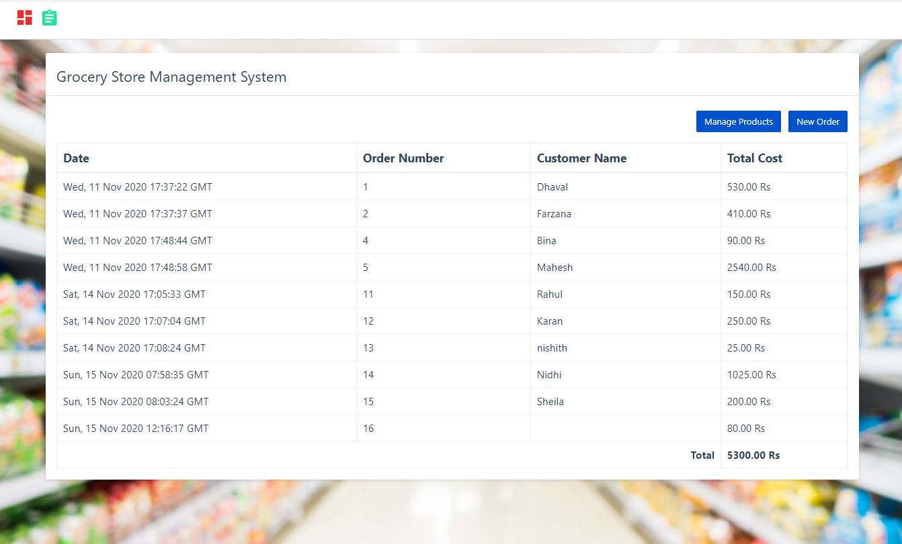

# python_projects_grocery_webapp
In this Python project, it will be 3 tier application.
1. Front end: UI is written in HTML/CSS/JavaScript/Bootstrap
2. Backend: Python and Flask
3. Database: MySQL

### Installation Instructions

Download MySQL for Windows: https://dev.mysql.com/downloads/installer/

`pip install mysql-connector-python`

